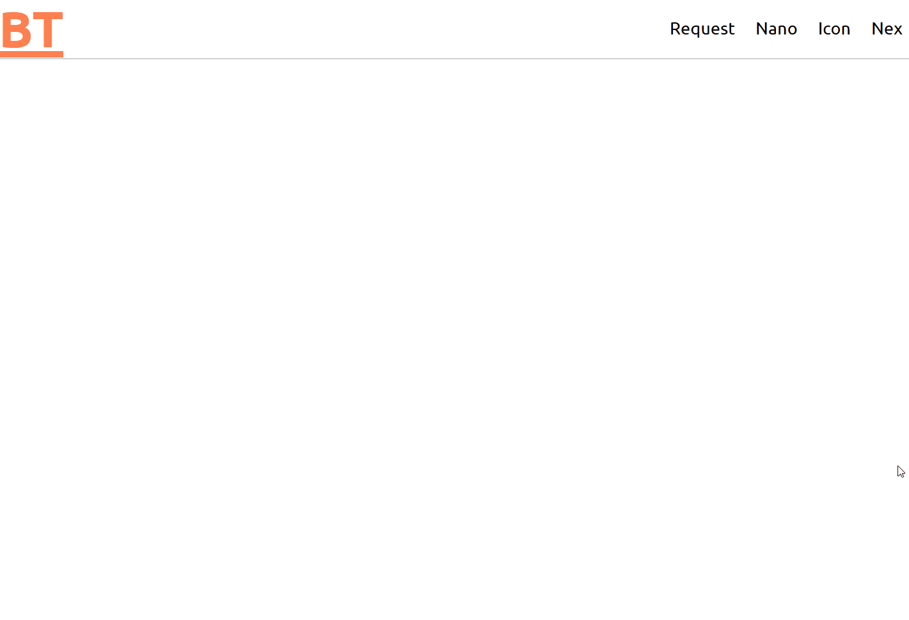

# Feature detection
>Feature detection involves working out whether a browser supports a certain block of code, and running different code dependent on whether it does (or doesn't), so that the browser can always provide a working experience rather crashing/erroring in some browsers. - [MDN](https://developer.mozilla.org/en-US/docs/Learn/Tools_and_testing/Cross_browser_testing/Feature_detection)

__Link to prototype__

[Hamburger menu](https://niyorn.github.io/browser-technologies/opdracht2/Hamburger_menu/index.html)

[Pop up](https://niyorn.github.io/browser-technologies/opdracht2/Pop_up/index.html)

## Hamburger menu
The hamburger is often used in a lot of modern site, but would happen if we have javascript disabled. Is the hamburger still functional? If not, how can we make the menu still functional for the people who doesn't have javacript enabled?

### Javascript
The hamburger is created without javascript in mind. So even when there is no javascript the user is still able to access the menu items. Alternatively the hamburger is only activated when javacript is enabled.

*This line of code only works, because javascript is enabled*
```javascript
    document.querySelector('header').classList.add('enhanced')
```

<details>
    <summary>Hamburger menu without javscscript</summary>
    
</details>

<details>
    <summary>Hamburger menu with javscscript</summary>
    
</details>

### CSS fallback
The fallback that is used to create a functional layout for all browsers.

#### CSS initual value
When setting the width of the nav bar a initial value is used to get the initial value of an element. When the test is done on IE, our layout broke and the navigation doesn't take whole width of the browser. In short IE doesn't support the css value *initial*.

```css
    nav li {
        width: 100%;
        width: initial;
    }
```


### Dialog tag
https://www.w3schools.com/TAGS/tag_dialog.asp
