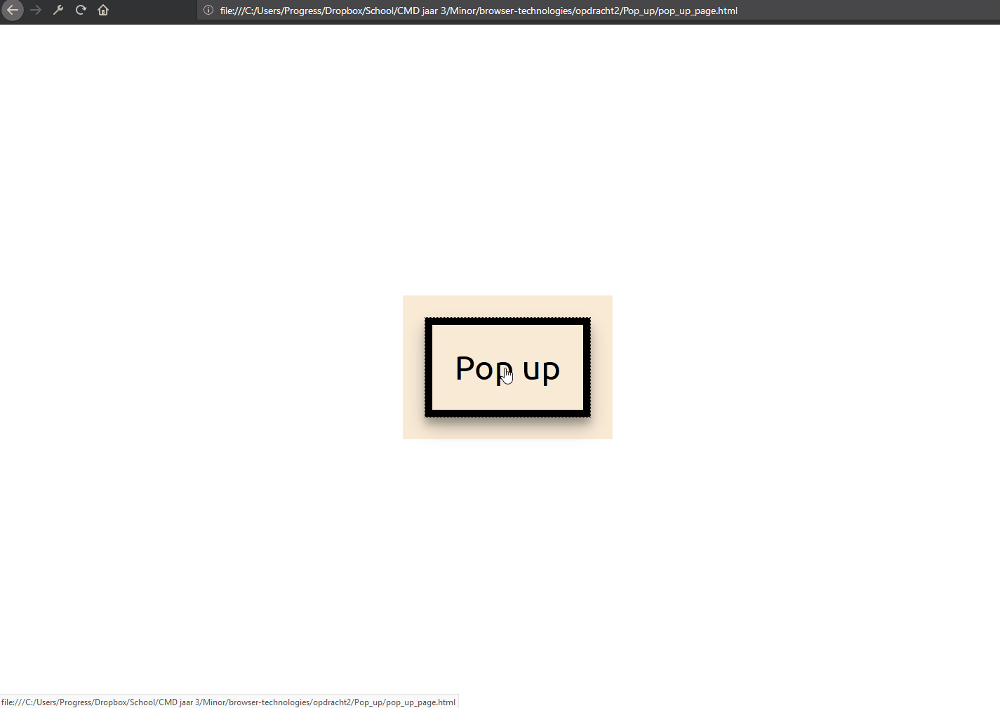
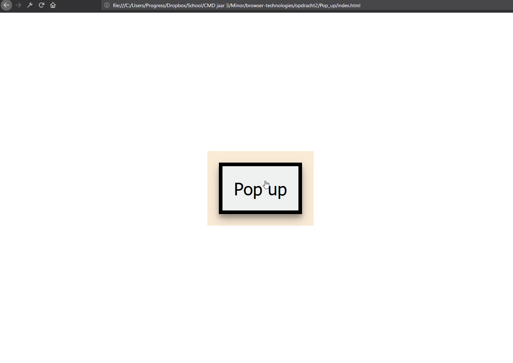

# Feature detection

## Feedback
*Change after feedback*

* [x] add readme
* [x] crossbrowser check (hamburger menu also works on other browsers instead only on firefox)
* [x] add feature detection

>Feature detection involves working out whether a browser supports a certain block of code, and running different code dependent on whether it does (or doesn't), so that the browser can always provide a working experience rather crashing/erroring in some browsers. - [MDN](https://developer.mozilla.org/en-US/docs/Learn/Tools_and_testing/Cross_browser_testing/Feature_detection)

__Link to prototype__

[Hamburger menu](https://niyorn.github.io/browser-technologies/opdracht2/Hamburger_menu/index.html)

[Pop up](https://niyorn.github.io/browser-technologies/opdracht2/Pop_up/index.html)

## Hamburger menu
The hamburger menu is often used in a lot of modern site, but would happen if javascript is disabled. Is the hamburger still functional? How can we make the menu still functional for the people who doesn't have javacript enabled?

### Javascript
The hamburger menu is created without javascript in mind. So even when there is no javascript the user is still able to access the menu items. Alternatively the hamburger is only activated when javacript is enabled.

*This line of code only works, because javascript is enabled*
```javascript
    document.querySelector('header').classList.add('enhanced')
```

<details>
    <summary>Hamburger menu without javscscript</summary>
    
</details>

<details>
    <summary>Hamburger menu with javscscript</summary>
    
</details>

### CSS fallback
The fallback that is used to create a functional layout for all browsers.

#### CSS initual value
When setting the width of the nav bar a initial value is used to get the initial value of an element. When the test is done on IE, our layout broke and the navigation doesn't take whole width of the browser. In short IE doesn't support the css value *initial*.

```css
    nav li {
        width: 100%;
        width: initial;
    }
```
#### Let and const
When I start developing the hamburger menu, I've declared variable with the __let__ and __const__. But I've found out later that not all browsers support this variable declaration and we need to do a feature detection for this syntax. But to my shame, I do not found a way to do this feature detection for this syntax. I've tried a try catch and if/else statement, but the browsers always gives an error when a let is found and will not execute any code further.

To fix this problem I did what I only know and that is changing let and const to var.


#### Classlist
Because we're using the classList syntax to add the *enhanced* class for creating the hamburger menu, we're going to check if the browser support this syntax.

```javascript
    var checkClassList = document.querySelector('body').classList;

    if (checkClassList) {
        console.log('browser support classlist');

    } else {
        console.log('browser doesnt support classlist')
        return false;
    }
```

And because we're using the *classList.toggle()* and the *classList.add()* we also need to check if the browser support this syntax.

```javascript
    var checkClassList = document.querySelector('body').classList;

    if (checkClassList) {
        console.log('browser support classlist');

        try {
            checkClassList.add();
            checkClassList.toggle();

            return true;
        } catch (err) {
            console.log('browser does not support classList.add or classList.toggle');
            return false;
        }

    } else {
        console.log('browser doesnt support classlist')
        return false;
    }
```

We're using a try/catch instead of if/else because if we're checking it with if/else the if/else will give a undifined back, but we know it does exist. With a try/catch it will trying to execute the function or else it will give an error.

### addEventListener
And lastly we need to check if the browser support the syntax *addEventListener*, because we want to check if the user have clicked on the hamburger menu.

```javascript
    //Check support for addEventListner
    if(document.addEventListener){
        console.log('browser support addEventListener');
        return true;
    }
    else{
        console.log('browser does not support AddEventListner');
        return false;
    }
```


## Pop up
The pop up is a functionality that is also often used in the web to attract the user attention. But how are we going to attract the user attention when javascript is disabled?

The solution that I've taken when javascript is disabled is to use the anchor element. When a pop up should be displayed, the user is taken to a new page where the pop up detail is showed.

The enhanced version of this, is showing the pop up on the same page as seen below.

<details>
    <summary>Pop up without javascript</summary>
    
</details>

<details>
    <summary>Pop up with javascript</summary>
    
</details>

As you can see the pop up is almost identical except that when javascript is disabled the pop up is shown on a new page.

### feature detection
The features we're using are:
- querySelector
- classList
- addEventListener

These are the same features that we've used on our hamburger menu, so we're going use the same code except that for classList toggle we're using the remove function.

```javascript
try {
    checkClassList.add;
    checkClassList.remove;
    console.log('browser support classList.toggle and classList.add');
} catch (err) {
    console.log('browser does not support classList.add or classList.toggle');
    return false;
}
```

### CSS fallback

CSS variable is not supported in all browsers so we're applying a basic styling as fallback where CSS variable is not supported.

```css
    box-shadow: 0 14px 28px rgba(0, 0, 0, 0.25), 0 10px 10px rgba(0, 0, 0, 0.22);
    box-shadow: var(--material-shaduw-2);
```

There is also a fallback for display:flex and that is ofcourse the display:block.
```css
    .pop-up.enabled {
        display: block;
        display: flex;
    }
```
