# To Do Application
link to protoype: [prototype](https://3be57c26.ngrok.io)


This application allow user to make an a simple todo list.

## Enhanced

When javacript is enabled, the user is able to reoder the list based on priority.

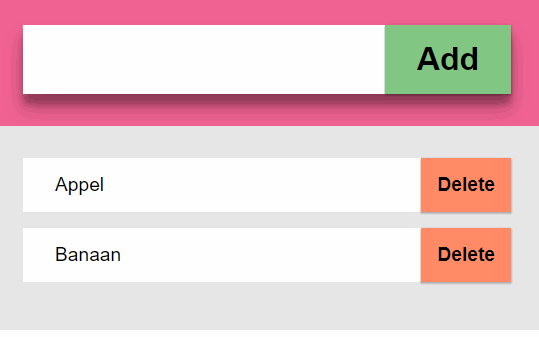;

## Functionality

This section will explain what the core functionality of the application is.

### User scenario
Katie wants to go the grocerie store, but got a lot items that she needs. She wants a way to keep track of all of the items that she needs.

### Core functionality
The user scenario suggets that the user wants a way to add item to a list and keep track this by adding new items or removing items that the user already have.

I choose to make this application in Node, because the core functionality of this application is adding an item to a list. Node make this possible even if javascript is disabled.

### enhacement
The make the experience more enjoyable, we're adding some styling to this application.

### super enhacement
The super enhacment of this application is to make the items re-order-able. The user is able to drag an item en reoder this item based on priority. So if the user finds a banana more important than an apple, than the user is able to swap the position of these items.

__Core functionality__: adding/removing item from a list

## Install

Get all dependencies
```
npm install
```

start application
```
npm start
```

The standart port is 4000

```
localhost:4000
```

## Feature detection
>Feature detection involves working out whether a browser supports a certain block of code, and running different code dependent on whether it does (or doesn't), so that the browser can always provide a working experience rather crashing/erroring in some browsers. - [MDN](https://developer.mozilla.org/en-US/docs/Learn/Tools_and_testing/Cross_browser_testing/Feature_detection)

*Flow of the program*

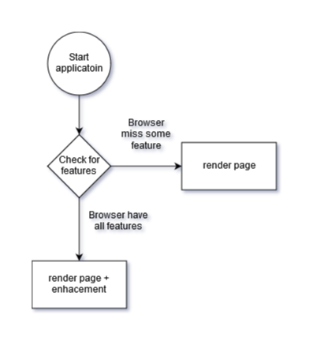

The features this application uses are: 
- Queryselector
- Classlist
- Eventlisteners
- Drag and Drop

### Queryselector
The syntax querySelector is almost supported in all browsers except some old version of IE and Firefox. To make sure we don't miss any browsers we're adding a check if a browser support this feature.

```javascript
//Check support for querySelecotr
if (document.querySelector) {
    return true;
} else {
    return false;
}
```
<details>
    <summary>Can I Use: querySelector</summary>
    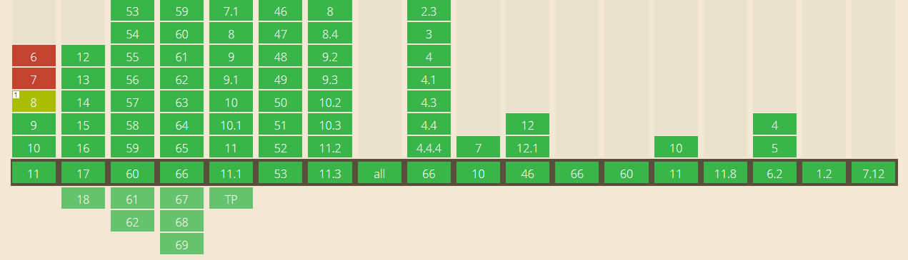
</details>

### Eventlisteners
To be able to add an action after a user input, we need to a way to listen to this event. We need an eventlistener.

```javascript
if (document.addEventListener) {
    return true;
} else {
    console.log('browser does not support AddEventListner');
    return false;
}
```

<details>
    <summary>Can I Use: addEventListener</summary>
    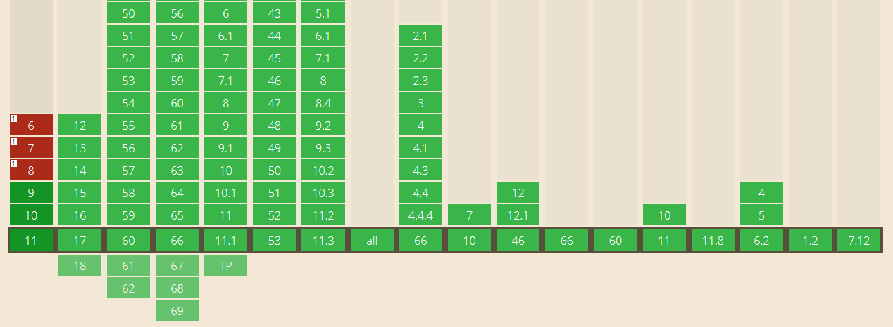
</details>

### Classlist
We are adding a background color to an item that are dropable. To achieve that, we need to add class when you're hovering over a item. So we need to check if the user browser support this feature.

```javascript
//Check support for classList
var checkClassList = document.querySelector('body').classList;
if (checkClassList) {
    console.log('browser support classlist');
    //Check support for classList.add() and classList.toggle()
    try {
        checkClassList.add;
        checkClassList.remove;
        console.log('browser support classList.toggle and classList.add');
        return true;

    } catch (err) {
        console.log('browser does not support classList.add or classList.toggle');
        return false;
    }

} else {
    console.log('browser doesnt support classlist')
    return false;
}
```

We're also checking if they support the add and remove featuer. Some browsers like IE doesn't support the second parameter for this function.

<details>
    <summary>Can I Use: classList</summary>
    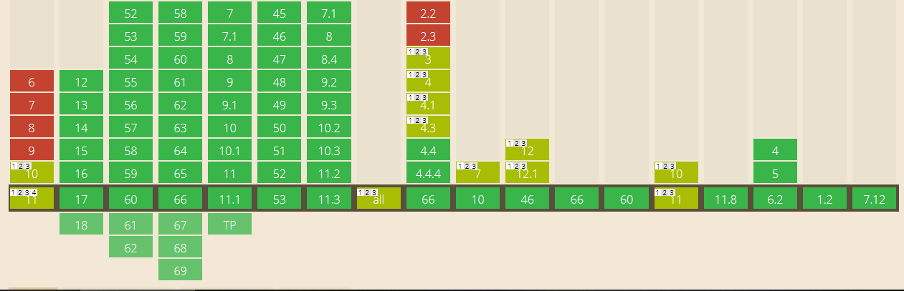
</details>

### Drag and drop
And last but not least is the drag and drop function. Our enhancement is that the user is able to rearange the items. So we need to check if the items are dragable.

```javascript
//Check if we can drag an element
if('draggable' in document.createElement('span')) {
    return true;            
}else{
    console.log('does not support drag and drop')
    return false;
}
```

Caniuse.com says that a lot of browsers support drag and drop, but not the full spectrum. IE have a limited support for the setData that is actually imported for our application. I have tried to add a feature detection for this feature but this was very difficult. According to Modernizr:
>File Drag 'n Drop (webkit doesnt expose a global DataTransfer constuctor to inspect) issue 57 - [Modernizr](https://github.com/Modernizr/Modernizr/wiki/Undetectables)

I don't have a good solution for this chalenge at the moment.

<details>
    <summary>Can I Use: classList</summary>
    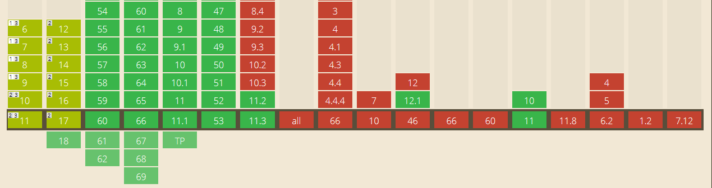
</details>

## Accessibility
In this section we're going to test the accessibilty of the application.

### Tabbing
Some user are not able to use the trackpad. To make this application still usable for those user, the application needs to be tabable. As you can see from the gif. When loaded the focus is immediately on the input field and when an item is added the user is able to tab to the delete button and delete it.
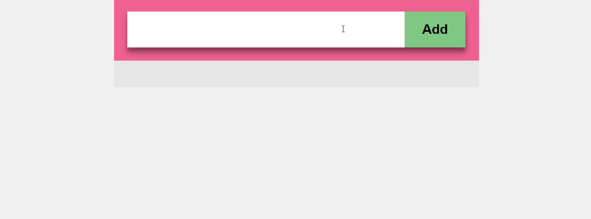

### Gray scale
when making application I've had color blind users in mind, that's why instead only relaying on the color, I've also added the word 'Add' and 'Delete' to the application. So even when the user are color blind, the application is still usable.
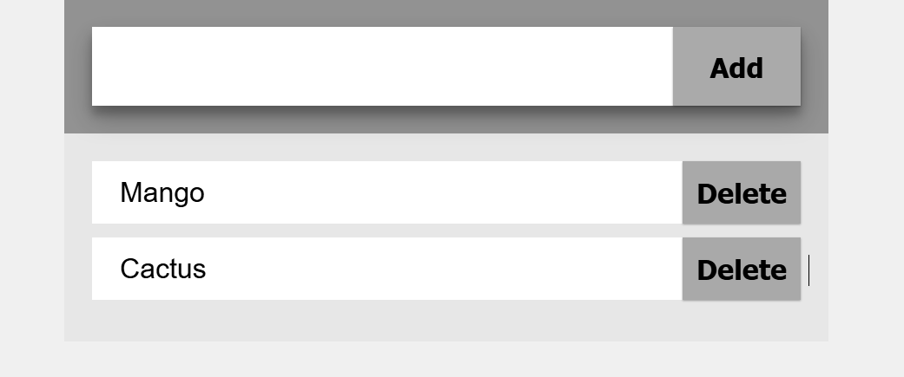

### Tritanopia
>*Tritanopia (less than 1% of males and females): Lacking the short-wavelength cones, those affected see short-wavelength colors (blue, indigo and a spectral violet) greenish and drastically dimmed, some of these colors even as black. Yellow is indistinguishable from pink, and purple colors are perceived as various shades of red.* - [wikipedia](https://en.wikipedia.org/wiki/Color_blindness#Tritanopia)

The result when this filter is applied is that the color are more dimmed. But the color green and red are still distinguishable. So no changes here.

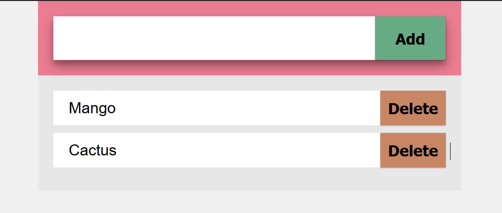

### Protanopia
>*Protanopia (1% of males): Lacking the red cones for long-wavelength sensitive retinal cones, those with this condition are unable to distinguish between colors in the green–yellow–red section of the spectrum.* - [wikipedia](https://en.wikipedia.org/wiki/Color_blindness#Protanopia)

When the protanopia the color are still distinguishable between each other. So also no changes here.
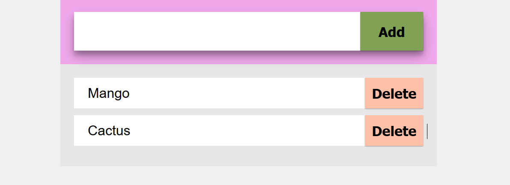

## Device lab
The application is tested in the device lab to see if the site is workable on mobile devices.

### Result
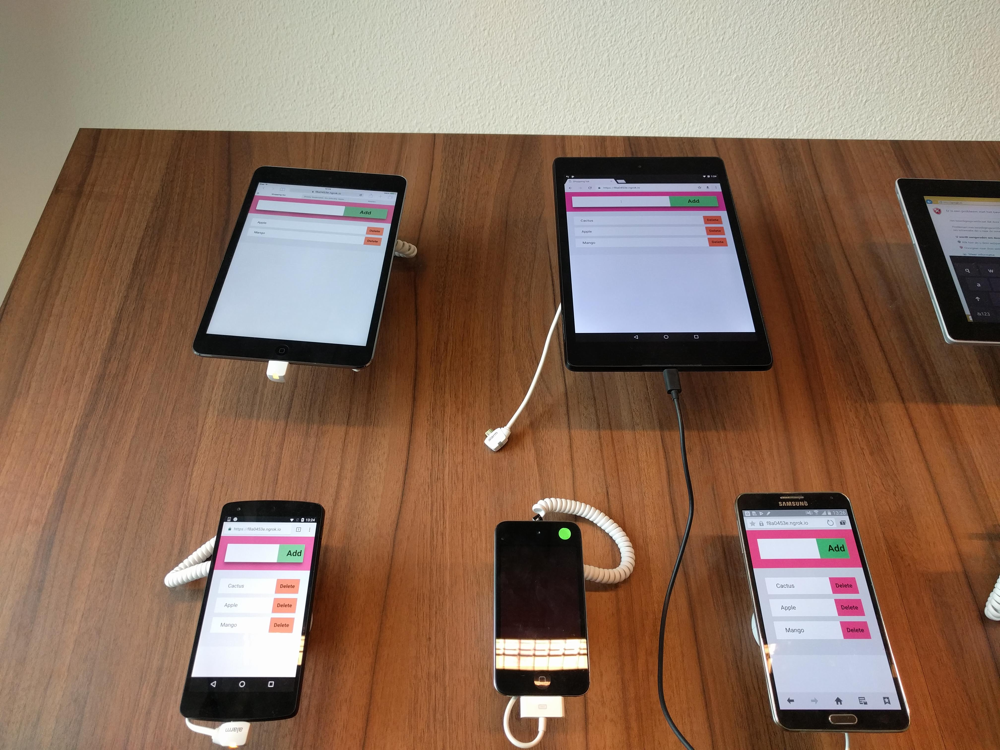
*Disclaimer: not all mobile devices works, so the application is only tested on devices that boot-up and have a browser with a internet connection*

Overal the test went better than exptected. As you can see from the picture, the CSS is loaded normally, so the styling works like intended. Only on the __Samsung__ phone is the delete button not the color that we intended, but because of our fallback, the color is still ok. The Add and Delete button is still distinquishable from eachother.

The core functionality -that is adding and delete items from the list- works on all of the devices. The user is able to add and delete items. Unfortunately only the HTC device is able to enhance our application. This is because this device have the latest version of Chrome. 

The changed that I want to add from this test, is that we when an enhancement is enabled, an indicator must show on mobile devices. On a desktop when an user hover over an item there is an indicator that you're able to change the position of the item, unfortunately this is not the same for mobile devices. On mobile device you're not able to hover over the items to know that you're able to change the order of an item. So there need to be an indicator to give feedback to the user that the items is changable.

## Browser test

### IE8
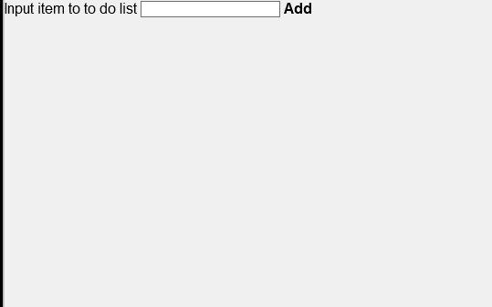

When testing on IE8 the core function still works, that is adding item to a list and remove them if needed be. 

The styling need some improvement to consider it acceptable. Those are:

- Color to differenciate the add and the delete button
- More spacing between items, so that the user knows it's not the same item
- Hover state on the button, to indicate that the buttons are clickable.

#### Improvement
__Color__

When we're applying the styling, we're applying them in nested manner like so.

```css
    header form button{
        font-size: 2em;
        padding: 1rem 2rem;
        background-color: green;
        background-color: var(--color-add);
    }
```
Because those element doesn't exist yet in IE8, the styling doesn't apply. To fix this we'll add classes to the button instead:

```css
    .button-add{
        font-size: 2em;
        padding: 1rem 2rem;
        background-color: green;
        background-color: var(--color-add);
    }
```

__Result__


__Spacing__

When we're applying our margin and padding, we're doing that with the *rem* size. Because IE8 doesn't support this, the styling will not apply. To fix this we'll need to add a fallback if the rem size doesn't work.

```css
    .button-add{
        font-size: 2em;
        padding: 16px 32px;
        padding: 1rem 2rem;
        background-color: green;
        background-color: var(--color-add);
    }
```
__Result__

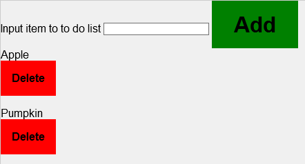

__Hover__

When hovering over the button no indication is used to give feedback to the user that the buttons are clickable. This is because we're using a css variable instead and this feature is not avaible in IE8, also box-shaduw doesn't exist.

```html
   button:hover, button:focus{
        box-shadow: var(--material-shaduw-4);
    }
```

Instead we'll using a simple indication that the button are clickable by applying a pointer and a border when hoverd over the buttons.

```html
   button:hover, button:focus{
        cursor: pointer;
        border: solid 5px black;
    }
```

__Result__


__Layout__

What we now have is that the buttons are below the item, instead we want in next to the item. 

After applying a float fallback this happened
``` html
li{
  float: left;
}
```

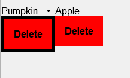

this happened because we're applying the float on whole element instead only on the text. To do this we'll need to wrap the text in a span and than apply a float attribute to it.


*EJS*
```jsx
    <li draggable="true">
      <span class="item-text"><%=i.item%></span>
      <form action="/delete" method="POST">
        <button class="button-delete" type="submit" name="delete" value="<%=i.id%>">Delete</button>
      </form>
    </li>
```

*CSS*
```css
.item-text{
  float:left
}
```
__Result__

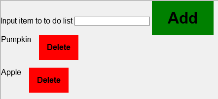


### IE9
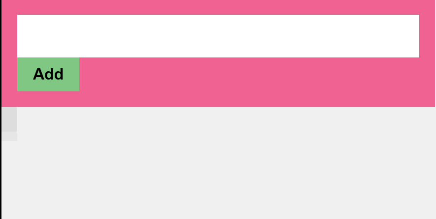

The core function works and the layout is acceptable.

also the browser doesn't support the Let and Const of ES6, so I've changed those back to Var.


## Terminology

### Modernizer
Modernizr is a small piece of JavaScript code that automatically detects the availability of next-generation web technologies in your user’s browsers. Rather than blacklisting entire ranges of browsers based on “UA sniffing,” Modernizr uses feature detection to allow you to easily tailor your user’s experiences based on the actual capabilities of their browser.- [Rlyn Ben](https://medium.com/@rlynjb/js-interview-question-what-s-the-difference-between-feature-detection-feature-inference-and-76d2e4956a9b)


Bron: drag and drop switch list
http://www.syntaxxx.com/rearranging-web-page-items-with-html5-drag-and-drop
