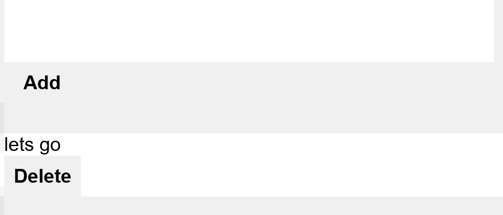

# To Do Application


This application allow user to make an a simple todo list. The core functionality is rendered serverside, so even if javascript is disabled the To Do is still functional.

## Enhanced

When javacript is enabled the user is able to reoder de list based on priority.


## Install

Get all dependencies
```
npm install
```

start application
```
npm start
```

The standart port is 4000

```
localhost:4000
```

## Test

### IE8


When testing on IE8 the core function still works, that is adding item to a list and remove them if needed be. 

The styling need some improvement to consider it acceptable. Those are:

- Color to differenciate the add and the delete button
- More spacing between items, so that the user knows it's not the same item
- Hover state on the button, to indicate that the buttons are clickable.

#### Improvement
__Color__

When we're applying the styling, we're applying them in nested manner like so.

```css
    header form button{
        font-size: 2em;
        padding: 1rem 2rem;
        background-color: green;
        background-color: var(--color-add);
    }
```
Because those element doesn't exist yet in IE8, the styling doesn't apply. To fix this we'll add classes to the button instead:

```css
    .button-add{
        font-size: 2em;
        padding: 1rem 2rem;
        background-color: green;
        background-color: var(--color-add);
    }
```

__Result__


__Spacing__

When we're applying our margin and padding, we're doing that with the *rem* size. Because IE8 doesn't support this, the styling will not apply. To fix this we'll need to add a fallback if the rem size doesn't work.

```css
    .button-add{
        font-size: 2em;
        padding: 16px 32px;
        padding: 1rem 2rem;
        background-color: green;
        background-color: var(--color-add);
    }
```
__Result__


__Hover__

When hovering over the button no indication is used to give feedback to the user that the buttons are clickable. This is because we're using a css variable instead and this feature is not avaible in IE8, also box-shaduw doesn't exist.

```html
   button:hover, button:focus{
        box-shadow: var(--material-shaduw-4);
    }
```

Instead we'll using a simple indication that the button are clickable by applying a pointer and a border when hoverd over the buttons.

```html
   button:hover, button:focus{
        cursor: pointer;
        border: solid 5px black;
    }
```

__Result__


__Layout__

What we now have is that the buttons are below the item, instead we want in next to the item. 

After applying a float fallback this happened
``` html
li{
  float: left;
}
```


this happened because we're applying the float on whole element instead only on the text. To do this we'll need to wrap the text in a span and than apply a float attribute to it.


*EJS*
```jsx
    <li draggable="true">
      <span class="item-text"><%=i.item%></span>
      <form action="/delete" method="POST">
        <button class="button-delete" type="submit" name="delete" value="<%=i.id%>">Delete</button>
      </form>
    </li>
```

*CSS*
```css
.item-text{
  float:left
}
```
__Result__


### IE9


The core functionality still works, the user is still able to add item to the list. But the color and the layout doesn't.
### Fallback
A fallback is added to give the color more style.
```html
    main li button{
        background-color: red;
        background-color: var(--color-delete);
    }
```


also the browser doesn't support the Let and Const of ES6, so I've changed those back to Var.
## Terminology
### Feature detection
Feature detection involves working out whether a browser supports a certain block of code, and running different code dependent on whether it does (or doesn't), so that the browser can always provide a working experience rather crashing/erroring in some browsers. - [MDN](https://developer.mozilla.org/en-US/docs/Learn/Tools_and_testing/Cross_browser_testing/Feature_detection)

```javascript
if (navigator.geolocation) {
 // detect users location here B-) and do something awesome
}
```
### Modernizer
Modernizr is a small piece of JavaScript code that automatically detects the availability of next-generation web technologies in your user’s browsers. Rather than blacklisting entire ranges of browsers based on “UA sniffing,” Modernizr uses feature detection to allow you to easily tailor your user’s experiences based on the actual capabilities of their browser.- [Rlyn Ben](https://medium.com/@rlynjb/js-interview-question-what-s-the-difference-between-feature-detection-feature-inference-and-76d2e4956a9b)


## Opdracht 3 - Progressive Enhanced Browser Technologies
//Browser Technologies onderzoeken en implementeren als enhancement. Basic functionaliteit van een use case doorgronden.

Maak een demo op basis van een use case. Zorg dat alle gebruikers, met alle browsers, in iedere context minimaal de core functionaliteit te zien/horen/voelen krijgen. Bouw je demo in 3 lagen, volgens het principe van Progressive Enhancement. Gebruik als enhanced feature een (hippe, innovatieve, vooruitstrevende) Browser Technologie die je gaat onderzoeken op functionaliteit, toegankelijkheid en (browser) ondersteuning.

### Beoordelingscriteria
- De code staat in een repository op GitHub
- Er is een Readme toegevoegd met daarin beschreven:
  - een beschrijving van de core functionality
  - een beschrijving van de feature(s)/Browser Technologies
  - welke browser de feature(s) wel/niet ondersteunen
  - een beschrijving van de accessibility issues die zijn onderzocht
- De demo is opgebouwd in 3 lagen, volgens het principe van Progressive Enhancement
- De user experience van de demo is goed
  - de leesbaarheidsregels zijn toegepast, contrast en kleuren kloppen
  - het heeft een gebruiksvriendelijke interface, met gebruikmaking van affordance en feedback op de interactieve elementen
  - met meest 'enhanced' versie is super vet, gaaf en h-e-l-e-maal te leuk om te gebruiken
- Student kan de Basic functionaliteit van een use case doorgronden
- Student kan uitleggen wat Progressive Enhancement en Feature Detectie is en hoe dit toe te passen in Web Development

### Usecases
Kies één van deze use cases. Combineren mag ook. De aangeboden Browser Technologie is bedoeld als tip om te onderzoeken, je kan ook een andere kiezen.
1. Ik wil in een lijst contacten kunnen zoeken, en details kunnen bekijken - Sticky Position
2. Ik wil een notificatie krijgen als mijn favoriete voetbalteam heeft gewonnen Notifications
3. Ik wil favoriete t-shirts-met-nerdy-teksten kunnen opslaan, en een volgende keer dat ik de site bezoek kunnen gebruiken - Web storage
4. Ik wil boodschappen-om-tostis-te-maken in mijn boodschappenlijstje kunnen gooien - Drag Drop
5. Ik wil tegen de helpdesk kunnen klagen over een i-frame-dat-het-niet-doet, en direct antwoord krijgen - Web RTC
6. Ik wil tijdens een college aan studenten een poll kunnen voorleggen en de resultaten meteen kunnen laten zien - Websocket
7. Ik wil kunnen beatboxen! - Web Audio
8. Ik wil tegen iemand anders een spelletje Pong spelen - Multi touch

Bron: drag and drop switch list
http://www.syntaxxx.com/rearranging-web-page-items-with-html5-drag-and-drop